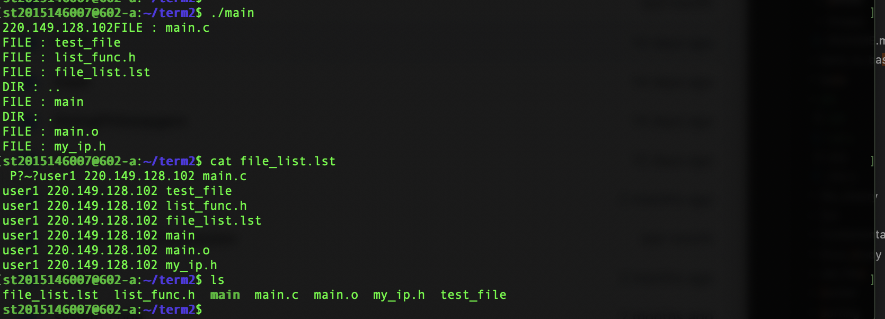

# 필요한 정보들

https://bodamnury.tistory.com/38


## 최종 텀프로젝트 구조

- 파일 리스트와 ip, port 번호를 리스트화 해서 갖고 있는 server가 존재
    - 각 유저는 server에 접속하여 자신의 디렉터리에 갖고있는 파일의 리스트를 업로드
        - 파일 양식은 1. test.c 192.168.0.120 5402 와 같이
            - 번호. {파일이름} {ip address} {port number} 형식으로 갖고있는다.
    - server concurrency 적용하여 여러 유저의 접속에 대해 대응 가능해야 한다.
        - 유저가 서버에 로그인 성공하였을때 유저들의 파일 목록(서버가 저장한)을 보고
            - 원하는 파일이 있다면 해당 유저와 P2P 연결을 하여 파일을 다운로드 받아야 함
        - 이 때 파일을 갖고있는 유저는 p2p server역할을 수행하면 될듯
        - client 프로그램은 p2p 요청을 하거나, 요청을 수락 할 때 fork 하여 통신을 하면 된다.
        - client의 p2p 요청 또한 server concurrency 구현 할 필요가 있다.
    
    
## 구현 내용

- term2 스콥
    - 1. 각 유저는 서버에 로그인 시도
        - 로그인 성공 시 자신의 디렉터리에 있는(실행파일이 있는)파일 리스트를 서버에 전송
        - 서버측에서는 {username}.{ipaddr}.lst 로 저장할 예정
        - 이 파일은 클라이언트가 로그인 성공시 생성해서 전송
    - 2. 서버는 저 lst 파일들을 모두 묶어서 관리.
        - 클라이언트가 서버에 파일 목록 보기 요청을 할 경우 묶어서 저장중 파일 목록 확인
            - 포맷은 {username} {ipaddr} {filename} 한줄씩임.

- in progress..


<strong>list_func.h</strong>

```c
#include <stdio.h>
#include <stdlib.h>
#include <dirent.h>
#include <unistd.h>
#include <string.h>
#include <fcntl.h>
#include <sys/stat.h>

#define LIST_FILE_NAME "file_list.lst"


// for now it just print
// we will make a file with name file_list.lst for server side use.
//with arguments username & ip address

void mklistf(char* username, char* ipinfo) {
    FILE *fp;
    char *cwd = (char *)malloc(sizeof(char)*1024);
    DIR *dir = NULL;
    struct dirent *entry = NULL; 

    //파일 내용을 채울 임시 버퍼
    char buf[100];
    //파일 정보 구조체
    struct stat info;
    getcwd(cwd, 1024);
    //for making list information file
    fp = fopen(LIST_FILE_NAME, "w+");//with overwriting mode
       if( (dir = opendir(cwd)) == NULL)
        {
                printf("current directory error\n");
                exit(1);
        }
        while((entry = readdir(dir)) != NULL)

        {
                lstat(entry->d_name, &info);
                if(S_ISREG(info.st_mode)){
                    printf("FILE : %s\n", entry->d_name);
                    strcat(buf, username);
                    strcat(buf, " ");
                    strcat(buf, ipinfo);
                    strcat(buf, " ");
                    strcat(buf, entry->d_name);
                    strcat(buf, "\n");
                    fputs(buf, fp);
                    memset(buf, 0, 100);
                }
                else if (S_ISDIR(info.st_mode)){
                    printf("DIR : %s\n", entry->d_name);
                }
                else {
                    printf("this is not a file or directory !\n");
                }

        }
        free(cwd);
        closedir(dir);
    }
```

<strong>my_ip.h</strong>

```c
#include <stdio.h>
#include <sys/ioctl.h>
#include <net/if.h>
#include <string.h>
#include <arpa/inet.h>
 

// 인자로 들어온 문자열 포인터에 현재 접속한 Linux server PC의 ip 주소 리터럴의 첫번째 주소를 넣어줌
// with strcpy
void myIp(char* buf)
{
    struct ifreq ifr;
    char ipstr[40];
    int s;
    
    s = socket(AF_INET, SOCK_DGRAM, 0);
    strncpy(ifr.ifr_name, "enp5s0", IFNAMSIZ);
 
    if (ioctl(s, SIOCGIFADDR, &ifr) < 0) {
        printf("Error\n");
        printf("check you network interface.\n");
    } else {
        inet_ntop(AF_INET, ifr.ifr_addr.sa_data+2,
                ipstr,sizeof(struct sockaddr));
        //no return, copy string to the argument's address.
        strcpy(buf, ipstr);
    }
}
```

<strong> 구현 사진 </strong>

