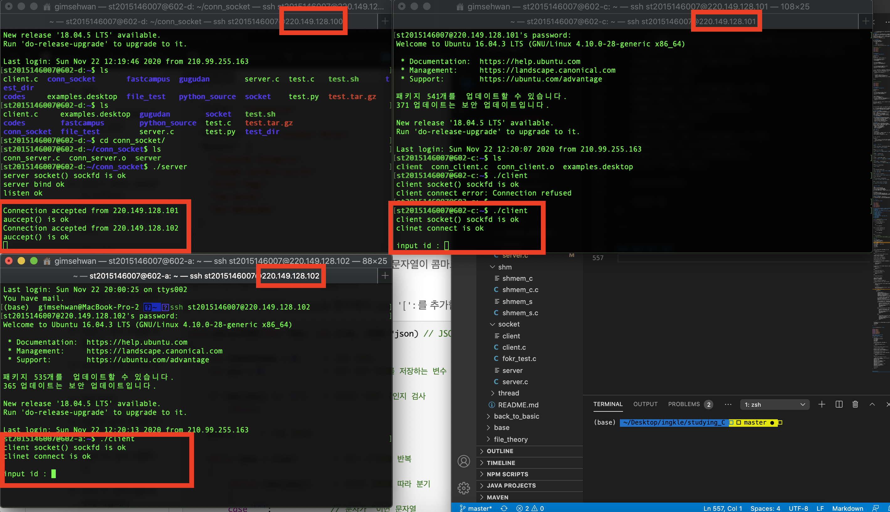
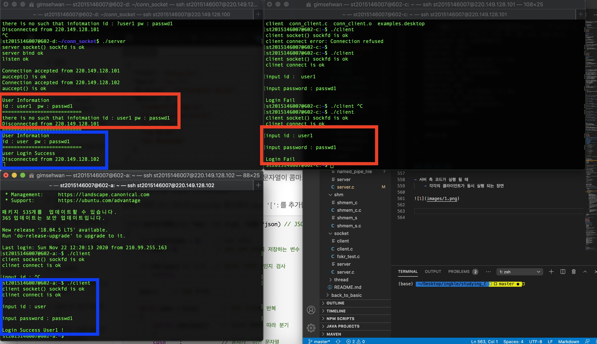

# 임베디드 운영체제
 
<strong> 2015146007 김세환 </strong>

## 기본 개념

### 소켓
- 표준 Unix File Descriptor를 이용한 다른 프로그램과 통신하는 방법.
- 파일은 Network 커넥션이나, FIFO, pipe, 터미널, 디바이스등 어떤것이든 파일이 될 수 있다.

### 서버-클라이언트 모델 (SC)
- TCP / IP는 Peer to peer(점대 점)통신이 가능하다.
- 대부분의 TCP IP 응용프로그램들은 각자 역할이 있다.
    - Server는 클라이언트의 요청을 기다리고, 요청에 대한 응답을 제공해준다
    - Client는 서비스를 서버에게 요청하고, 응답을 받는다.

### UDP와 TCP의 차이

- User Datagram Protocol (UDP)
    - 커넥션 없이 진행된다
    - 하나의 소켓은 다른 여러 컴퓨터로부터 데이터를 주고 받을 수 있다.
    - Best effort 전송 방식 (최대 노력 전송방식)
        - 이는 즉 어느것도 보장해주지 못한다는 이야기임

- Transmission Control Protocol (TCP)
    - 커넥션 기반의 통신방식
    - 클라이언트는 소켓을 반드시 서버와 연결해야 함
    - TCP 소켓은 클라이언트와 서버간의 양방햐 통신 채널을 제공한다
    - 손실된 데이터는 재전송 된다.
    - 데이터는 순서를 보장해서 전달된다
    - 데이터는 바이트 스트림 형태로 넘어간다
        - 즉 Socket기반 데이터 통신은 바이너리 데이터 기반으로 진행된다는거.
    - TCP는 흐름제어를 한다.

### TCP/IP API
- API란 OS에서 정의된 응용프로그램과 프로토콜 소프트웨어 간의 인터페이스다.
- 특정 제조사에 디펜던시가 있는 데이터 포멧이나 기능의 사용을 피하기 위해서는 표준 API를 사용해라
- API는 오직 필요한 기능들만 제공해주고, 나머지는 프로그래머의 구현에 달려있음
- UNIX에서는 socket(버클리 시스템 콜)과 TLI (Transport Layer Interface) 크게 두종류의 표준 API가 있다
- UNIX TCP/IP API들은 커널 시스템 콜임


### 소켓 인터페이스
- 소켓은 IPC를 위한 API임.
- Inter Process Communication ?
    - 프로세스간 통신 방법으로
        - 소켓
        - 파이프
        - FIFO
        - shared memory 등등이 있음.

<strong> 간단한 named pipe (FIFO) 예제 코드 </strong>

```C
/* named pipe sever code */
#include <fcntl.h>
#include <sys/stat.h>
#include <unistd.h>
#include <stdio.h>
#include <stdlib.h>
#include <time.h>
#include <string.h>


#define MSG_SIZE 80
#define PIPENAME "./named_pipe_file"

int main(void) {
  char msg[MSG_SIZE];
  int fd;
  int nread, rc;
  double startTime, endTime, benchmark = 0;

  /* 기존에 named pipe가 있으면 삭제 */
  if (access(PIPENAME,F_OK) == 0) {
    unlink(PIPENAME);
  }

  /* named pipe 생성하기 */
  if ((rc = mkfifo(PIPENAME,0666)) < 0) {
    printf("fail to make named pipe\n");
    return 0;
  }

  /* named pipe 열기, Read Write가능 해야 한다 */
  if ((fd = open(PIPENAME, O_RDWR)) < 0) {
    printf("fail to open named pipe\n");
    return 0;
  }
  
  /* 시작한 시간의 CPU클럭과, 종료되었을 때의 CPU클럭을 비교해 시간 계산*/
  startTime = (float)clock()/CLOCKS_PER_SEC; //start to benchmark
  while (1) {
    if ((nread = read(fd, msg, sizeof(msg))) < 0 ) {
      printf("fail to call read()\n");
      return 0;
    }

    if (strcmp(msg, "exit") == 0) {
        endTime = (float)clock()/CLOCKS_PER_SEC;
        benchmark = endTime - startTime;
        printf("total processed time %.3lf 초\n", benchmark);
        return 0;
    }
  }
  return 0;
}


/* named pipe client code */

#include <fcntl.h>
#include <sys/stat.h>
#include <unistd.h>
#include <stdio.h>
#include <stdlib.h>
#include <string.h>

#define MSG_SIZE 80
#define PIPENAME "./named_pipe_file"

int main(void) {
  char msg[MSG_SIZE];
  int fd;
  int nread, i;

  /* named pipe 열기, Write 전용으로 열기 */
  if ((fd = open(PIPENAME, O_WRONLY)) < 0) {
    printf("fail to open named pipe\n");
    return 0;
  }

  /* Data를 보낸다. */
  /* 1000만개의 데이터를 보냄. */
  for (i = 0; i < 10000000; i++) {
    snprintf(msg, sizeof(msg), "Send Message[%i]", i);
    if ((nread = write(fd, msg, sizeof(msg))) < 0 ) {
      printf("fail to call write()\n");
      return 0;
    }
  }
  snprintf(msg, sizeof(msg), "exit"); //signal for server that above logic is done.
  write(fd, msg, sizeof(msg));
  return 0;
}

```

* named pipe(fifo)역시 파이프를 `file`개념으로써 만들어 사용한다.

- 소켓은 두 프로세스를 연결하는 방법 중 매우 잘 알려진 방법이다.
- 프로토콜과 언어에 종속성이 없다. (java, c, python등 모두 동일하게 사용 가능)
- Berkeley Sockets 혹은 BSD Sockets로 자주 인용된다.

### 소켓 Descriptor(서술자)
- UNIX open()은 파일 디스크립터를 생성해낸다.
- UNIX는 파일 서술자 테이블을  각 프로세스마다 열린 파일에 대한 데이터들의 포인터를 배열로서 유지한다.
- 하나의 파일 디스크립터는 배열의 인덱스로 사용된다.
- 소켓들은 이것들에 추상적으로 추가된다.
- socket() 시스템 콜은 소켓 디스크립터를 리턴한다.
- 테이블 엔트리에 의해 포인트된 구조체는 해당 소켓인지 파일인지 구분하는 필드를 갖고 있음 (잘 이해가 안갑니다..)

### 시스템 데이터 구조(소켓)
- 소켓을 사용하기 위해서는 아래의 데이터들이 필요하다.
    - Protocol Family : 소켓 콜을 위한 파라미터
    - Service Type(Stream, Datagram): 소켓을 위한 파라미터
    - Local IP Address : bind()로 설정 가능
    - Local Port : bind()로 설정 가능
    - Remote IP Address : connect()로 설정 가능
    - Remote Port : connect()로 설정 가능

### 소켓 Endpoint
- TCP/IP 통신은 2개의 엔드포인트 상에서 발생한다.
- 하나의 엔드포인트는 IP 주소와 포트 넘버로 정의된다.
- 다른 프로토콜들을 소켓 개념에 합치려면, address families가 사용된다.
- protocol family 로써 AF_INET을 사용 할 예정.
- AF_INET의 소켓 타입은 다음과 같다.
    - STREAM : TCP (SOCK_STEREAM)
    - SEQPACKET : SPX (SOCK_SEQPACKET)
    - DGRAM : UDP (SOCK_DGRAM)
    - RAW : IP (SOCK_RAW)

### 소켓 구조체
- IPv4에 대해서 확인
```c
struct sockaddr_in {
    u_char sin_len;
    u_short sin_family; // Address Family에 대해서. (AF_INET)
    u_short sin_port; // port 번호
    struct in_addr sin_addr; // IP주소
    char sin_zero[8]; // sockaddr과 같은 사이즈
}
```

- 위 in_addr 구조체 내용
```c
struct in_addr {
    union{
        struct { u_char s_b1, s_b2, s_b3, s_b4; } S_ub_b; //4bytes
        struct { u_short s_w1, s_w2; } S_un_w; //4bytes
      u_long S_addr; //4bytes
    } S_un;
  }
}
```

### 사용하게 될 시스템 콜들

- socket()
    - 새로운 소켓을 생성하고 그것의 디스크립터를 반환 함
```c
int socket(int domain, int type, int protocol);
```

- bind()
    - 포트와 주소를 소켓과 연결함
```c
int bind(int sockfd, struct sockaddr *my_addr, int addrlen);
```

- listen()
    - 소켓에 대한 커넥션을 listen
```c
int listen(int sockfd, int backlog);
```

- accpet()
    - 소켓에 대한 커넥션 요청을 받아들임
```c
int accpet(int sockfd, struct sockaddr *addr, int *addrlen);
```

- connect() 
    - 원격 호스트에 대한 커넥션을 초기화 함
```c
int connect(int sockfd, struct sockaddr *serv_addr, int addrlen);
```

- close()
    - 단 방향 소켓 디스크립터 닫기
```c
int close(int sockfd);
```


- send()
    - 소켓 디스크립터로 데이터를 보냄
```c
int send(int sockfd, const void *msg, int len, int flags);
```
- 리턴 값이 음수이면 실패?

- recv()
    - 소켓 디스크립터로부터 데이터를 받음
```c
int recv(int sockfd, void *buf, int len, unsigned int flags);
```
- 리턴 값이 음수이면 실패?

- write()
    - 파일이나 디바이스, 소켓등에 쓰기 작업
```c
ssize_t write(int fd, const void *buf, size_t count);
```

- read()
    - 파일, 디바이스, 소켓등으로부터 읽기 작업
```c
ssize_t read(int fd, *void buf, size_t count);
```


### TCP 시스템 콜 흐름

- 서버측
1. 서버가 소켓 디스크립터를 연다.
2. bind()로 특정 Ip 및 포트를 bind 한다.
3. listen으로 클라이언트 요청을 기다린다.
4. 클라이언트의 요청이 있으면 accpet()한다.
5. 클라이언트의 요청을 read하고, 서버에서 write해서 클라이언트에게 보내준 후 close.

- 클라이언트 측
1. 클라이언트가 소켓을 연다.
2. connect()로 원격 호스트에 연결 요청을 한다.
3. connection이 established (서버의 accpet)가 되면 요청을 주고 응답 받고 
4. 소켓을 close 해준다. (파일을 연뒤 항상 닫는 것 처럼 똑같이.)

### Server Concurrency
- 서버는 여러 유저의 응답을 대응해야 한다.
- 즉, 서버는 요청이 들어올 때 마다 fork() 시스템 콜을 이용하여
- 자식 프로세스를 생성해서 각 자식 프로세스가 각각의 요청에 대응해준다.


# 실제 구현 코드 !

<strong> 서버 측 코드 </strong>

```c
#include <stdio.h>
#include <stdlib.h>
#include <string.h>
#include <unistd.h>
#include <sys/types.h>
#include <sys/socket.h>
#include <netinet/in.h>
#include <arpa/inet.h>

#define SERV_IP "220.149.128.100" // 서버의 로컬 호스트 주소를 define
#define SERV_PORT 4140 //서버의 포트 번호를 define
#define BACKLOG 10
// 사용자에게 전달할 메시지 정의
#define INIT_MSG "===================\n Hi this is p2p test plz login\n ===============\n"
#define ID_REQ "input id : "
#define PW_REQ "input password : "
#define USER1_ID "user"
#define USER1_PW "passwd1"
#define USER2_ID "user2"
#define USER2_PW "passwd2"
// 유저 인증 함수에서 사용할 Magic Number 정의.
#define USER1_LOGIN 1
#define USER2_LOGIN 2
#define LOGIN_FAIL 0

// 유저의 인증로직을 위한 함수.
unsigned int authenticate(char *id, char *pw)
{
    if (strcmp(id, USER1_ID) == 0)
    {
        if (strcmp(pw, USER1_PW) == 0)
        {
            return USER1_LOGIN;
        }
        else
        {
            return LOGIN_FAIL;
        }
    }
    else if (strcmp(id, USER2_ID) == 0)
    {
        if (strcmp(pw, USER2_PW) == 0)
        {
            return USER2_LOGIN;
        }
        else
        {
            return LOGIN_FAIL;
        }
    }
    else
        return LOGIN_FAIL;
}
// 유저의 id와 passwd를 인자로 받아, 사전 정의된 유저 정보에 대해서만 처리
// 더 좋은 방법이 있을 것 같지만 이번 과제에서는 이렇게 처리할 예정,

int main(void)
{
    int sockfd, new_fd;
    struct sockaddr_in my_addr;
    struct sockaddr_in their_addr;
    unsigned int sin_size;
    //fork이후 pid 체크를 위해서,
    pid_t childpid;
    int rcv_byte;
    //입출력 처리를 할 문자열 버퍼들
    char buf[512];
    char id[20];
    char pw[20];
    char msg[512];

    int val = 1;


    sockfd = socket(AF_INET, SOCK_STREAM, 0); //TCP
    if (sockfd == -1)
    {
        perror("server-socker() error");
        exit(1);
    }
    else
        printf("server socket() sockfd is ok \n");

    //address family로 AF_INET 정의.
    my_addr.sin_family = AF_INET;

    my_addr.sin_port = htons(SERV_PORT);

    my_addr.sin_addr.s_addr = INADDR_ANY;

    memset(&(my_addr.sin_zero), 0, 8);

    if (setsockopt(sockfd, SOL_SOCKET, SO_REUSEADDR, (char *)&val, sizeof(val)) < 0)
    {
        perror("setsockopt");
        close(sockfd);
        return -1;
    }

    if (bind(sockfd, (struct sockaddr *)&my_addr, sizeof(struct sockaddr)) == 1)
    {
        perror("bind err ");
        exit(1);
    }
    else
        printf("server bind ok \n");

    if (listen(sockfd, BACKLOG) == -1)
    {
        perror("linsten error");
        exit(1);
    }
    else
    {
        printf("listen ok\n\n");
    }

    //버퍼를 모두 0으로 초기화.
    memset(id, 0, sizeof(id));
    memset(pw, 0, sizeof(pw));

    sin_size = sizeof(struct sockaddr_in);

    // 메인 루프, 인터럽트, return, break; 발생 전까지 무한루프.
    for (;;)
    {
        new_fd = accept(sockfd, (struct sockaddr *)&their_addr, &sin_size);
        if (new_fd < 0)
        {
            exit(1);
        }
        printf("Connection accepted from %s\n", inet_ntoa(their_addr.sin_addr));

        if ((childpid = fork()) == 0)
        {
            close(sockfd);
            for (;;)
            {
                //accept 이후 로직.
                printf("auccept() is ok\n");
                send(new_fd, ID_REQ, strlen(ID_REQ) + 1, 0);
                read(new_fd, id, sizeof(id));
                send(new_fd, PW_REQ, strlen(PW_REQ) + 1, 0);
                read(new_fd, pw, sizeof(pw));
                //id를 서버에서 요청 후 저장, pw도 요청 후 저장

                //유저가 입력한 내용을 서버에서 출력
                printf("===========================\n");
                printf("User Information\n");
                printf("id : %s  pw : %s \n", id, pw);
                printf("===========================\n");

                // 인증 로직을 실행, 좋은 코드는 아닌 것 같습니다.
                if (authenticate(id, pw) == USER1_LOGIN)
                {
                    printf("%s Login Success \n", id);
                    send(new_fd, "Login Success User1 ! \n", 512, 0);
                    printf("Disconnected from %s\n", inet_ntoa(their_addr.sin_addr));
                    close(new_fd);
                    break;
                }
                else if (authenticate(id, pw) == USER2_LOGIN)
                {
                    printf("%s Login Success\n", id);
                    send(new_fd, "Login Success User2 ! \n", 512, 0);
                    printf("Disconnected from %s\n", inet_ntoa(their_addr.sin_addr));
                    close(new_fd);
                    break;
                }
                else
                {
                    printf("there is no such that infotmation id : %s pw : %s\n", id, pw);
                    send(new_fd, "Login Fail \n", 512, 0);
                    printf("Disconnected from %s\n", inet_ntoa(their_addr.sin_addr));
                    close(new_fd);
                    break;
                }
            }
        }
    }
    //sockfd와 새로운 소켓 연결을 정의하던 new_fd 모두 close.
    close(new_fd);
    close(sockfd);

    return 0;
}
```

<strong> 클라이언트 측 코드 </strong>

```c
#include <stdio.h>
#include <stdlib.h>
#include <unistd.h>
#include <string.h>
#include <sys/types.h>
#include <sys/socket.h>
#include <netinet/in.h>
#include <arpa/inet.h>

#define SERV_IP "220.149.128.100"
#define SERV_PORT 4140

int main(int argc, char *argv[])
{
    int sockfd;
    struct sockaddr_in dest_addr;
    int rcv_byte;
    char buf[512];
    char id[20];
    char pw[20];

    sockfd = socket(AF_INET, SOCK_STREAM, 0);
    if (sockfd == -1)
    {
        perror("client-socker() error");
        exit(1);
    }
    else
        printf("client socket() sockfd is ok \n");

    dest_addr.sin_family = AF_INET;

    dest_addr.sin_port = htons(SERV_PORT);
    dest_addr.sin_addr.s_addr = inet_addr(SERV_IP);

    memset(&(dest_addr.sin_zero), 0, 8);

    if (connect(sockfd, (struct sockaddr *)&dest_addr, sizeof(struct sockaddr)) == -1)
    {
        perror("client connect error");
        exit(1);
    }
    else
        printf("clinet connect is ok \n\n");

    //서버로부터 id, pw 요청을 받고 보내는 로직, 좋은 코드는 아닌듯 합니다.
    read(sockfd, buf, sizeof(buf));
    printf("%s", buf);
    scanf("%s", id);
    send(sockfd, id, strlen(id) + 1, 0);
    memset(buf, 0, sizeof(buf));
    read(sockfd, buf, sizeof(buf));
    printf("\n%s", buf);
    scanf("%s", pw);
    send(sockfd, pw, strlen(pw) + 1, 0);
    memset(buf, 0, sizeof(buf));
    read(sockfd, buf, sizeof(buf));
    printf("\n%s", buf);

    close(sockfd);

    return 0;
}

```

### 실제 동작 화면

- 서버 측 코드가 실행 될 때
    - 각각의 클라이언트가 동시 실행 되는 장면




- 클라이언트의 id, pw 입력후 서버와 클라이언트의 동작 화면



### 파이썬 socket programming과의 비교.
- 소켓은 언어간 종속성이 없고, 그 언어에서 소켓을 구현해놨다면 동일하게 사용 가능?

- 실제 진행했던 프로젝트(코드를 실제 구동에 쓰진 않고 테스트 용으로 사용했던)코드 확인

```python3
import os
import json
from socket import *
from datetime import datetime
from time import sleep
from struct import pack, unpack

# default Bosch gateway's sampling time = 100ms
TEST_DATA_SOURCE = {
  "id": "main_plc",
  "edgeId": "test",
  "name": "Main PLC",
  "payload": {
    "fields": [
        "brake",
        "pressure",
        "temperature",
        "valve"
    ],
    "format": "hhh",
    "preprocessedFields": [
        {
            "field": "valve",
            "inputRanges": None,
            "normalizedRanges": None,
            "decimalPoint": 2
        },
        {
            "field": "vibration",
            "inputRanges": None,
            "normalizedRanges": None,
             "decimalPoint": 1
        }
    ],
    "type": "ARRAY"
  },
  "period": 1000 # 100ms
}

TEST_BUFF = {
    'brake': [29.0, 30, 40], 
    'valve': [10, 20, 30], 
    'pressure': [1, 2, 3], 
    'tempreature': [1, 1, 1]
    }

fields = TEST_DATA_SOURCE['payload'].get("fields")
sampling_time = TEST_DATA_SOURCE.get("period")

def init_buffer(fields: list): #input fields list
    BUFF = {}
    for i in fields:
        BUFF[i] = []
    return BUFF

# sending binary data as [brake_value, pressure_value, temperature_value, valve_value]
def convert_data(user_data, data):
    fmt = user_data['payload']['format']
    return pack(fmt, *data)

def split_data(byte_data: bytes):
    decoded_data = byte_data.decode('utf-8')
    split_data = decoded_data.split('\n')
    processed_list = split_data[:-1:]
    return processed_list

def vaildate_data(byte_data: bytes):
    if byte_data.decode('utf-8')[-1::] != '\n':
        return False
    else:
        return True

def parsing_data(list_data: list, buf: dict):
    for i in list_data:
        dict_data = json.loads(i)
        field = list(dict_data.keys())[0]
        buf[field].append(dict_data[field])
    #print("parsed dict {}".format(buf))
    return buf

def latest_data(stored_buffer: dict, fields: list):
    latest_list = []
    for i in fields:
        try:
            latest_list.append(stored_buffer.get(i)[-1])
        except IndexError as e: #when first few ms in this code runs, PR21 Doesn't send all of fields datas so we need to wait few ms
            latest_list.append(None)
    stored_buffer = init_buffer(fields) # reset buffer
    print("this is latest_data{} : time stamp {}".format(latest_list, datetime.now()))
    return latest_list
#TODO: making latest_data function to get latest data in dictionary

def recv_msg(host: str, port: int, fields: list):
    print("this is fields {}".format(fields))
    buf = init_buffer(fields)
    sock = socket(AF_INET,SOCK_STREAM)
    sock.bind((host,port))
    sock.listen(1)
    connectionSock, addr = sock.accept() #inital connection printing
    print(str(addr), "address")
    while True:
        data = connectionSock.recv(65536)
        while vaildate_data(data) == False:
            data += connectionSock.recv(65536)
        result = split_data(data)
        #print(result)
        #print("-"*50)
        stored_buf = parsing_data(result, buf) #dictionary return
        sleep(sampling_time/1000)
        latest_data(stored_buf, fields) # this is actual pushing data

        #TODO: 데이터를 수집한 이후 dict 데이터를 주기적으로 clear 할 필요가 있음.
        # 그렇지 않으면 메모리 누수 발생함. 
        # 주기적으로 init_buffer를 하는게 맞을듯.

if __name__ == "__main__":
    print(init_buffer(fields))
    buff = init_buffer(fields)
    recv_msg('', 55065, fields)
```


- 소켓 사용을 위해서
    - AF_INET, SOCK_STREAM과 같은 파라미터와
    - bind, listen, accept, recv와 같은 비슷한 명칭의 함수가 정의되어있었다.

```python3
    sock = socket(AF_INET,SOCK_STREAM)
    sock.bind((host,port))
    sock.listen(1)
    connectionSock, addr = sock.accept() #inital connection
    while True:
        data = connectionSock.recv(65536)
        while vaildate_data(data) == False:
            data += connectionSock.recv(65536)
        result = split_data(data)
```


### 느낀점

- 서버가 여러 클라이언트의 요청을 동시 수용 가능하긴 하지만.
    - 서버측 코드가 무한 루프로 요청에 대해서 계속해서 listen하는 상태
    - 무한루프 자체가 PC 리소스를 매우 많이 잡아먹기 때문에
    - Event 발생시에만 connection을 맺는 그런 코드가 존재하면 좋겠다고 생각했습니다.
    - 거대한 규모의 클라이언트가 동시 접속하는 상황이라면 정말 Performance 관리를 잘 해야하지 않나 라는 생각이 들었습니다.

- 보통 커넥션을 계속 맺고있을 필요가 없는 요청/응답에 대해서는 TCP connection이 아닌 
- HTTP를 이용한 request, response 구조가 더 적절 할 것 같고.
- 게임과 같이 실시간으로 connection을 계속해서 establish 해야 한다면?
    - Socket기반의 connection이 맞아보입니다.
    - 게임 서버는 성능이 매우 중요하므로 상대적으로 빠른 언어 (C, C++)로 구현해야 할 것 같습니다.